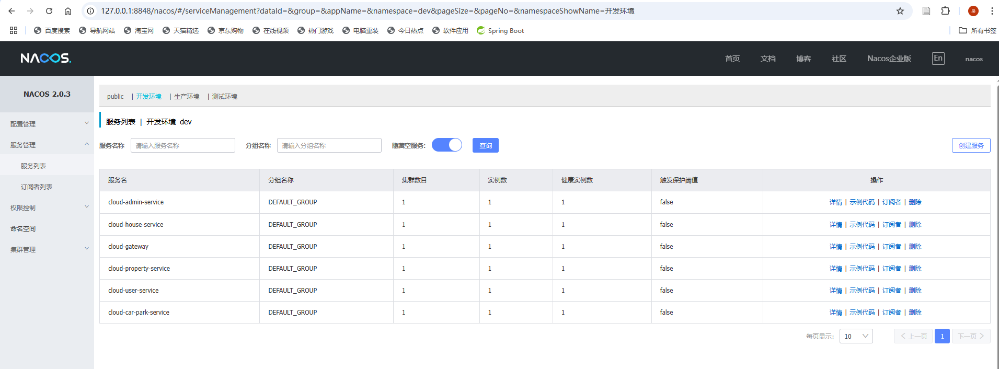
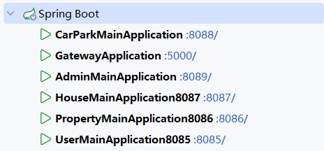
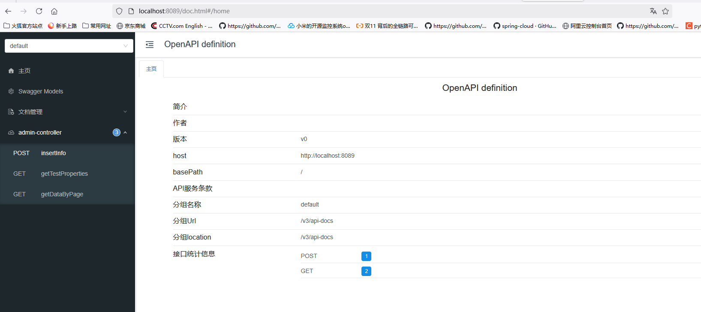

# 这是README-microservice-template说明文档
<div align="center">
    
</div>
<br>

## 关于这个分支
这个分支旨在提供一个分布式微服务模板示例。

## 拉取并运行
```shell
git clone -b microservice-template https://github.com/yang66-hash/PropertyManagementCloud.git 
```
在本地运行，并无需额外配置，使用的是Java jdk 17, maven3.x即可。各个服务加载完依赖即可直接启动运行。

请按照如下顺序操作：
1. 将一级文件夹下的property_db_cloud.sql数据转储到本地的mysql数据库中
2. 执行下面操作之前，先安装并启动nacos2.0.x nacos server 
3. 依照config-center中说明文档将服务注册到nacos 
4. 依照register-center中说明文档将配置文件持久化存储至nacos配置中心(可选)
5. 无顺序启动cloud-admin-service|cloud-property-service|cloud-house-service|cloud-user-service|cloud-car-park-service业务服务 
6. 启动cloud-gateway，动态路由配置以及负载均衡可以查看gateway的配置文件信息


启动启动所有的服务之后，登录localhost:8848/nacos,可以查看到在dev开发环境下，有以下注册服务：

各个服务的启动端口


各个微服务的接口查看、测试界面可以通过Knife4j提供的接口访问：localhost:PORT/doc.html, 示例如下：

## 各个文件夹说明

|        模块        |       功能说明        |
|:----------------:|:-----------------:|
|      common      | 各个模块依赖的基础类相关公共子工程 |
|  admin-service   |    小区物业管理员管理服务    |
| car-park-service |      停车位管理服务      |
|  house-service   |      住房管理服务       |
| property-service |      物业管理服务       |
|   user-service   |      住户管理服务       |
|   clou-gateway   |       API网关       |
|  config-center   |    配置中心如何启动的说明    |
| register-center  |   服务注册中心如何启动的说明   |


## 部署说明
怎么打成jar，并部署至K8S集群，参见admin-service的README.md(这一部分是由我其他项目工作引用而来，还未完全修改，并不是直接可以用，因为里面参入了一些其他的额外配置)
后续会继续修改


**Suggestions and project Improvement are Invited**


