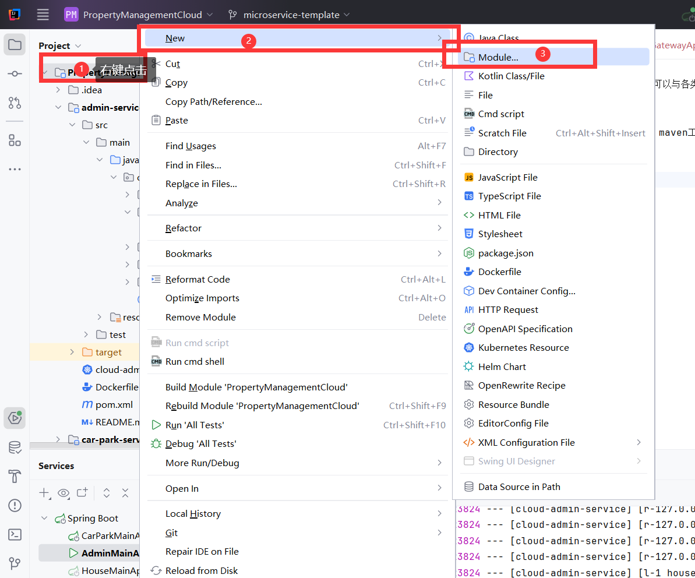
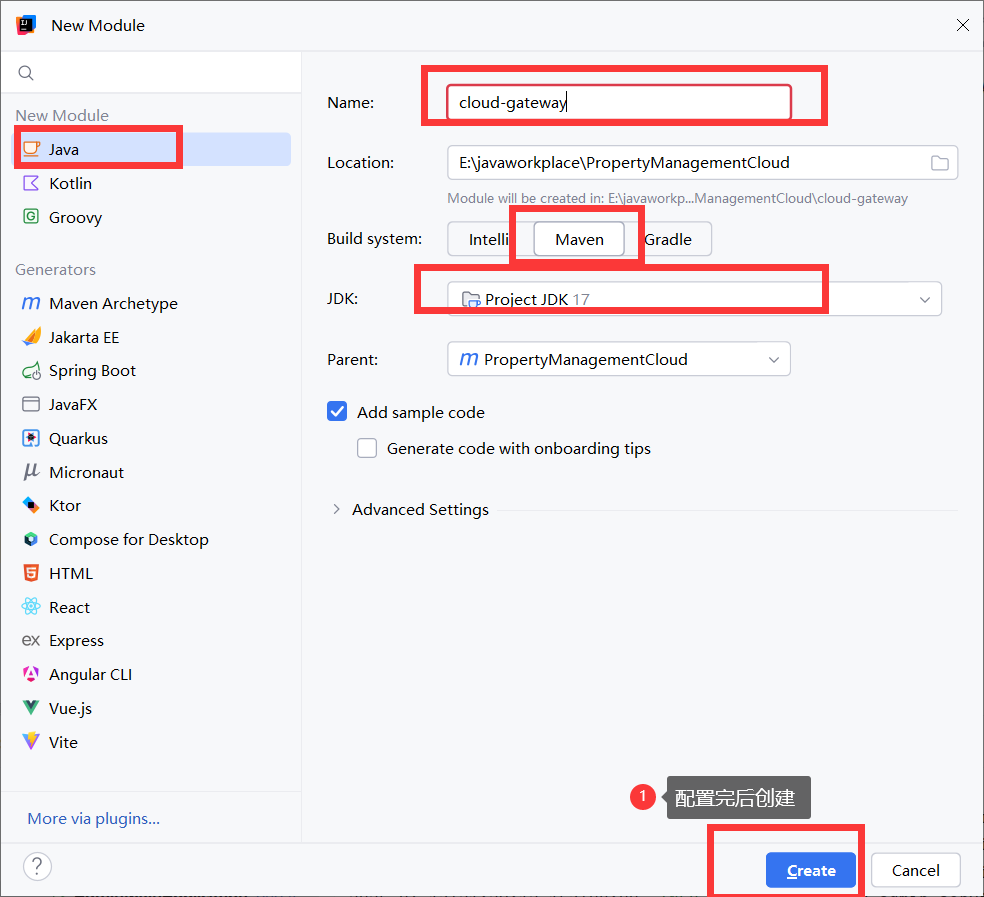
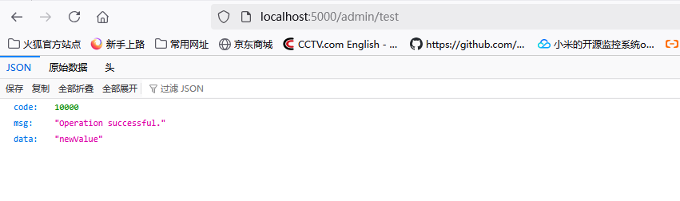

# 花5min阅读以下内容 怎样创建Spring Cloud Gateway
在Spring cloud 生态中，Spring Cloud Gateway作为API网关，可以与各类服务注册中心进行集成，可以实现动态路由以及服务发现等功能。

## 如何搭建一个Gateway网关服务并将该网关服务也注册到nacos中
**1. 添加依赖** 

在微服务工程中创建Gateway子工程，这个项目中就是cloud-gateway maven工程。


接着导入在pom.xml文件中dependencies标签中导入spring-cloud-starter-gateway依赖以及nacos相关依赖(如果也需要将配置文件配置到nacos中，参照cloud-admin-service中的说明文档即可。文档中不说明动态配置的部分，但是这个网关以及所有的服务我都会默认实现动态配置)。 

因为在parent父工程中已经导入了spring cloud和Spring Cloud Alibaba的全家桶组件的同一版本依赖，所以下面的组件导入不需要version标签。
```xml
        <dependency>
            <groupId>org.springframework.cloud</groupId>
            <artifactId>spring-cloud-starter-gateway</artifactId>
        </dependency>
        <!--这个实现负载均衡-->
        <dependency>
            <groupId>org.springframework.cloud</groupId>
            <artifactId>spring-cloud-loadbalancer</artifactId>
        </dependency>
        <dependency>
            <groupId>com.alibaba.cloud</groupId>
            <artifactId>spring-cloud-starter-alibaba-nacos-discovery</artifactId>
        </dependency>
```
2. 配置application-dev.yml
```yaml
server:
  port: 5000

spring:
  application:
    name: cloud-gateway
  cloud:
    gateway:
      discovery:
        locator:
          enabled: true # 开启自动路由
          url-expression: "'lb://' + serviceId"  # 很重要 从注册中心拿到服务注册的信息列表 每一个服务的名字对应 serviceId，最终使用 Spring EL 表达式进行格式化。
      routes:  # 网关路由配置
        - id: cloud-admin-service  # 路由id，自定义，唯一
          uri: lb://cloud-admin-service  # 路由的目标地址，lb表示负载均衡
          predicates:   # 路由断言，判断请求是否符合路由规则
            - Path=/admin/**
    nacos:
      discovery:
        server-addr: 127.0.0.1:8848
        namespace: dev
```
若是不不将gateway的配置保存至nacos中，那么再resources文件下再创建一个application.yml，其中内容如下：
```yaml
spring:
  profiles:
    active: dev # 激活dev配置文件
```
最后我们通过gateway的负载均衡以及路由转发，就能将请求localhost:5000/admin/**的请求都转发到cloud-admin-service服务下。


