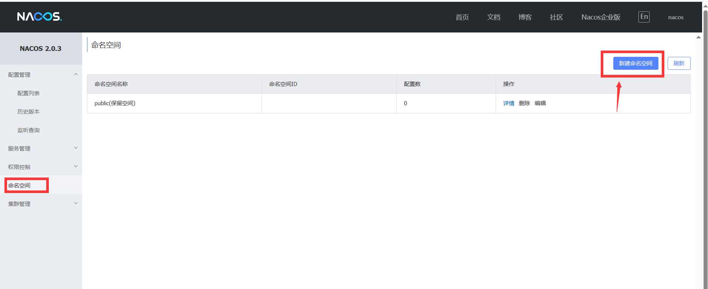
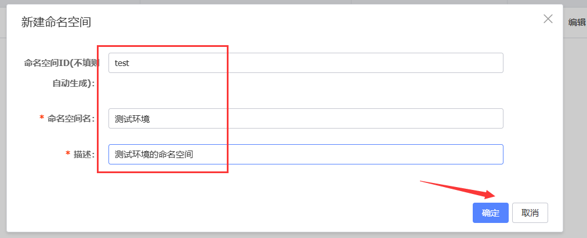
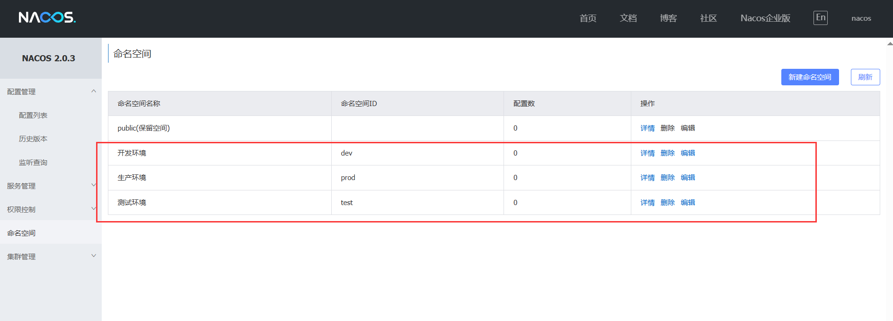
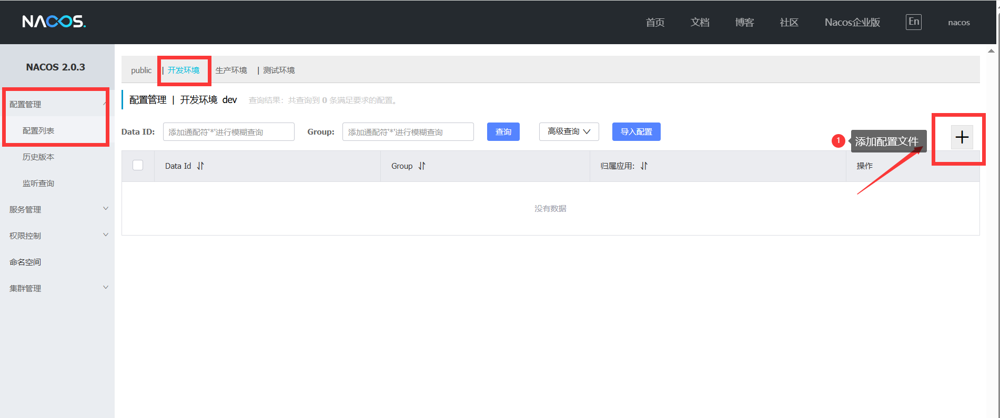
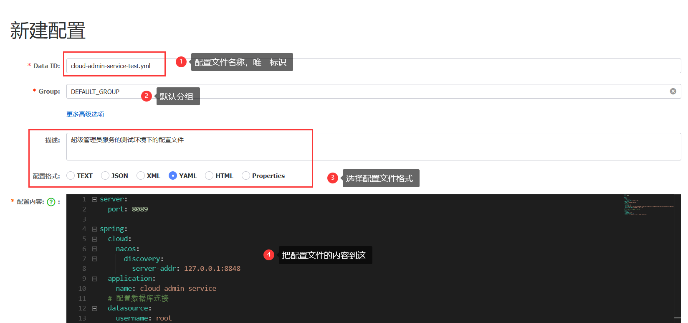
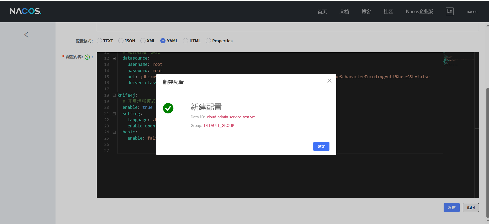
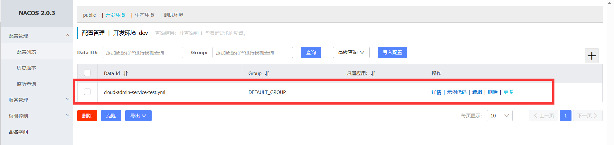
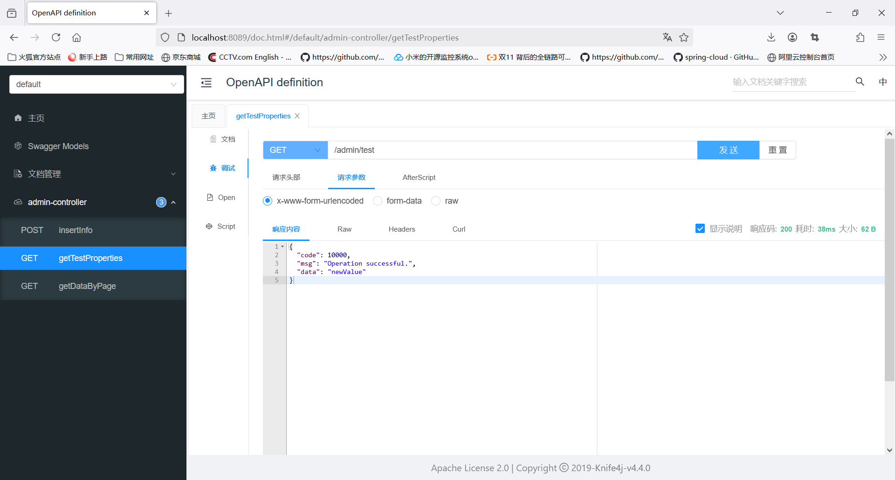

# 花2-3min读完以下内容，了解如何将Nacos设置为配置中心

# 配置中心的设置
Nacos是阿里巴巴开源的一个动态服务发现、配置管理和服务管理平台。作为配置中心，Nacos能够统一管理各种应用配置，实现配置的动态更新和统一管理，无需重启应用即可生效，解决了传统配置管理的诸多痛点。

本文的配置中心直接采用Nacos server。
Spring Cloud Alibaba 2023.0.x如何使用Nacos实现配置管理参考[官方指南](https://sca.aliyun.com/docs/2023/user-guide/nacos/quick-start/?spm=5176.29160081.0.0.74805c72tMIQQf)

# 如何下载Nacos
去到官网下载并安装 Nacos server 到本地，这一部分网上教程很多，不再细说，下载版本2.x.x即可。这个示例工程中的nacos不仅作为配置中心，同时也是服务注册中心。
这里可以给出一个网上windows上的安装[教程](https://blog.csdn.net/weixin_62079735/article/details/138094336)。

# 如何启动Nacos配置功能以及cloud-admin-service使用示例
执行这些流程之前，请确保你已经跑起一个Nacos Server。

通过[localhost:8848/nacos]()登录nacos界面。账号密码默认是nacos。登录之后创建各个环境下(dev\test\prod)的命名空间：





创建成功之后命名空间显示如下：


下面的示例演示将dev环境下将cloud-admin-service下配置信息application-dev.yml拷入nacos的过程，实现在nacos上动态更新微服务的配置信息。
因为我们在parent工程的pom.xml已经导入了Spring Cloud Alibaba全家桶组件的统一版本定义，所以在admin-service的pom.xml下就无需编写版本号，直接导入nacos配置中心以及注册中心相关依赖

```xml
<!--        注册中心依赖-->
        <dependency>
            <groupId>com.alibaba.cloud</groupId>
            <artifactId>spring-cloud-starter-alibaba-nacos-discovery</artifactId>
        </dependency>
        <!--        配置中心依赖-->
        <dependency>
            <groupId>com.alibaba.cloud</groupId>
            <artifactId>spring-cloud-starter-alibaba-nacos-config</artifactId>
        </dependency>
        <!--提供了引导配置的支持，允许应用程序在启动时从外部配置中心（如 Nacos、Consul、Config Server 等）加载配置。-->
        <dependency>
            <groupId>org.springframework.cloud</groupId>
            <artifactId>spring-cloud-starter-bootstrap</artifactId>
        </dependency>

```
在完成相关依赖导入之后，在resource文件夹下创建bootstrap.properties文件并将以下设置写入：

```properties
# 服务名称
spring.application.name=cloud-admin-service
# 需要激活的开发环境
spring.profiles.active=dev

spring.cloud.nacos.discovery.server-addr=127.0.0.1:8848
spring.cloud.nacos.discovery.namespace=dev
spring.cloud.nacos.config.server-addr=127.0.0.1:8848
spring.cloud.nacos.config.namespace=dev
spring.cloud.nacos.discovery.group=DEFAULT_GROUP
spring.cloud.nacos.config.file-extension=yml

```
在dev环境下创建cloud-admin-service的配置信息文件


将application-dev.yml中的配置信息拷入nacos中创建的配置文件




这样就能实现cloud-admin-service服务相应配置信息的持久化存储以及配置信息的动态更新。

到这将Nacos作为配置中心，并将cloud-admin-service的配置文件实现动态配置就完成了。

直接启动cloud-admin-service服务，要是能够正常启动说明cloud-admin-service配置成了！也可以通过cloud-admin-service提供的getTestProperties接口去测试，看看是否能够取到test.value,动态修改（通过@RefreshScope和@Value注解实现）后获取的test.value的值是否有改动。
接口的测试直接登录127.0.0.1:8089/doc.html（Knife4j依赖支持）
